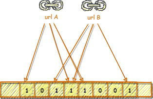

# MySearchEngine

MySearchEngine 是一个学习与实践文本搜索相关知识的个人项目。它基于C#语言在.Net 5.0环境下开发。

## 目标
尽量不使用第三方工具，自己实现一个简单的搜索引擎。其数据来源于网络。我们从爬取某网页开始，然后分析内容，创建索引。最后能够完成搜索，并按照得分顺序返回结果。

## 项目结构
MySearchEngine 由三个可运行客户端和一个核心Library项目组成。

- MySearchEngine.Core

  在Core中包含文本搜索的一些基础算法。

- MySearchEngine.QueueService

  这是一个简单的消息中间件。它负责把网络爬虫爬下来的HTML内容传送给Server端，并由Server端创建索引。

- MySearchEngine.WebCrawler

  WebCrawler是一个网络爬虫。

- MySearchEngine.Server

  Server端对网络爬虫爬得的HTML内容创建索引，并提供搜索的API端口。

## 阶段&过程
1. 网络爬虫阶段

   在爬虫阶段，我觉得[DifferenceBetween](https://www.differencebetween.com)是一个不错的网站。所以我想对它做一下内容爬取。但是因为DifferenceBetween上面的大部分文章内容太过于学术化，所以我们就选取容易理解的[Language Category](https://www.differencebetween.com/category/language/)开始吧……

   

1. 索引创建阶段
   
   
1. 索引数据保存阶段

1. 搜索阶段

