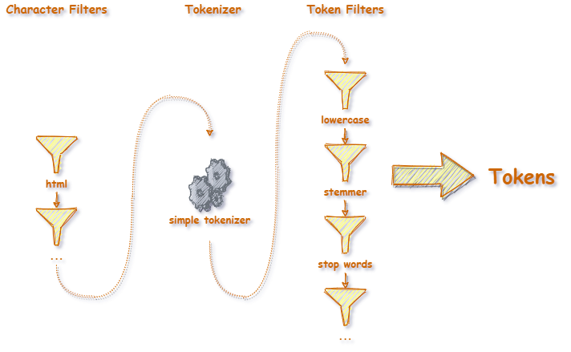
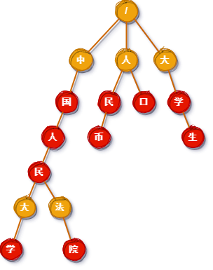

# MySearchEngine

[English](README.md) | 中文

MySearchEngine 是一个学习与实践文本搜索相关知识的个人项目。它基于C#语言在.Net 5.0环境下开发。

## 目标
尽量不使用第三方工具，自己实现一个简单的搜索引擎。其数据来源于网络。我们从爬取某网页开始，然后分析内容，创建索引。最后能够完成搜索，并按照得分顺序返回结果。

## 如何启动
1. 启动[QueueService](start_queue.bat)。
1. 启动[WebCrawler](start_crawler.bat)。输入任意一个URL开始爬取。注意这边只会爬取拥有相同域名的链接。按任意键退出。
1. 启动[Server](start_sever.bat)。后台线程会开始文本分析。可以通过Swagger网页进行搜索。


注：如果想跳过爬取阶段，也可以复制[res_bak](res_bak)目录下的文件到[res](res)文件夹中。我已经预先爬取了10,000+个网页供搜索。即便如此，QueueService必须要运行。

## 项目结构
MySearchEngine 由三个可运行客户端和一个核心Library项目组成。


注：Client可以为任意调用Server API的客户端

- MySearchEngine.Core

  在Core中包含文本搜索的一些基础算法。

- MySearchEngine.QueueService

  这是一个简单的消息中间件。它负责把网络爬虫爬下来的HTML内容传送给Server端，并由Server端创建索引。

- MySearchEngine.WebCrawler

  WebCrawler是一个网络爬虫。

- MySearchEngine.Server

  Server端对网络爬虫爬得的HTML内容创建索引，并提供搜索的API端口。

## 阶段&过程
1. 网络爬虫阶段

   在爬虫阶段，我觉得[DifferenceBetween](https://www.differencebetween.com)是一个不错的网站。所以我想对它做一下内容爬取。但是因为DifferenceBetween上面的大部分文章内容太过于学术化，所以我们就选取容易理解的[Language Category](https://www.differencebetween.com/category/language/)开始吧……  
   爬虫的主要工作就是下载网页，读取网页内的所有超链接。然后选择我们认为有价值的链接再爬取。如此循环往复。其中值得一提的点是***如何判断网页链接是否已经爬取过？***。  
   很显然随着时间的推移，已爬取链接的数量剧增。仅使用Arrary，Dictionary或者HashMap都不太实际。它们要么有性能问题，要么占用太多内存资源。这边推荐使用***布隆过滤器***来实现。  

   > ***布隆过滤器***
   > [布隆过滤器](https://en.wikipedia.org/wiki/Bloom_filter)是一种非常高效、资源利用率高的数据结构。它维护一个定长的bit数组。它的原理是通过若干个不同的Hash函数来对源文本取Hash值。把Hash值取模之后，在过滤器中的相应位置的bit值置为1。  
   > 通过这样的方式，对新的源文本，一次查询就可得知此源文本“可能在列表中”（所有bit位为1）或者“绝对不在列表中”（至少一个bit位为0）。   
   > 布隆过滤器的问题是依然会有哈希碰撞，导致新的源文本有几率会被误认为已被访问。不过这种情况在网络爬虫中是可被接受的，因为结果无非是少爬取几个网页罢了。 
   >
   > 
   >
   > 代码实现[BloomFilter](src/MySearchEngine.Core/Algorithm/BloomFilter.cs)

1. 索引创建阶段
  
   在索引创建的阶段，其实质就是对文本进行分析的过程。文本分析的结果就是一组Token，也就是文本中的单词或者词组。  
   这里参考了Elasticsearch的Analyzer的设计。分析分为三个过程：Character filter(s), Tokenizer, Token filter(s)。其中Filter(s)可以有多个，按顺序执行。  
   - Character filter(s)：可以对原始文本所包含的字符进行添加、删除或者更改。
   - Tokenizer：把经过Character filter(s)之后的内容分解为Token。因为这里爬取的都是英文网站，所以使用最简单的基于whitespace的分解。
   - Token filter(s)：对已经分解好的Token进行进一步的处理。比如转化为小写，合并相同词根，添加同义词等等。 
   
   
   > ***文本分析***过程  
   >
   >   
   > 
   > 以如下内容作为例子：  
   > ```html
   > <div><p>The QUICK brown fox jumps.</p></div>
   > ```
   > 
   > |加工|描述|输出|
   > |---|---|---|
   > |[HtmlElementFilter](src/MySearchEngine.Core/Analyzer/CharacterFilters/HtmlElementFilter.cs)|删除HTML元素。 |The QUICK brown fox jumps. |
   > |[SimpleTokenizer](src/MySearchEngine.Core/Analyzer/Tokenizers/SimpleTokenizer.cs)|以whitespace拆分文本为一组Token。只保留字母和数字。|["The", "QUICK", "brown", "fox", "jumps"]|
   > |[LowercaseTokenFilter](src/MySearchEngine.Core/Analyzer/TokenFilters/LowercaseTokenFilter.cs)|把Token更新为小写字符。|["the", "quick", "brown", "fox", "jumps"]|
   > |[StemmerTokenFilter](src/MySearchEngine.Core/Analyzer/TokenFilters/StemmerTokenFilter.cs)|把Token更新为它的根（ 使用[PorterStemmer](https://iq.opengenus.org/porter-stemmer/)）。|["the", "quick", "brown", "fox", "jump"]|
   > |[StopWordTokenFilter](src/MySearchEngine.Core/Analyzer/TokenFilters/StopWordTokenFilter.cs)|删除停止词。|["quick", "brown", "fox", "jump"]|
   >
   > 详情请参考[Analyzer Anatomy](https://www.elastic.co/guide/en/elasticsearch/reference/current/analyzer-anatomy.html)
   
   以上是基本的文本分析过程。显然它们只是对文本的简单处理。在正式场景中，我们一定会遇到更多问题。比如对短语和其他语言的支持，Auto-Complete等等。
   
   - 对短语和其他语言的支持  
   
   譬如像``Renmin University of China``这样的短语，或者中文``中国人民大学``这样无法通过whitespace来做拆分的情况，该如何支持搜索呢？  
   首先我们需要准备一个短语列表。值得注意的是，除了那些常用的短语之外，根据不同的领域，列表也是会不同的。有了短语列表，我们就可以创建一颗字典树。  
   
   > ***Trie 字典树***
   >
   > 如我们所见，像``中国人民大学``这样的短语中其实包含着多个短语，如下图所示。  
   >   
   >
   > 划线部分的短语都应该出现在我们的列表中。基于此，我们来创建Trie字典树。它的基本原理是除了根节点之外，把每一个短语都像下图一样加入到树中。注意红色的节点都代表一个短语的结束。  
   >   
   >
   > 代码实现[Trie](src/MySearchEngine.Core/Algorithm/DocumentTrie.cs)
   
   有了这棵树之后，接下来我们只要拿候选语句在树上爬一遍，就知道其中有多少个短语了。这些短语就将记作Token。我们希望爬完``中国人民大学``之后会返回5个短语。这里要介绍一下Aho-Corasick（AC自动机）。
   
   > ***Aho-Corasick（AC自动机）***
   >
   > 代码实现[Aho-Corasick](src/MySearchEngine.Core/Algorithm/AcPatternMatcher.cs)
   
   > ***Auto-Complete***
   >
   > Auto-Complete即是指根据你的输入，自动补完内容的功能。就像Google搜索栏中的那样。
   >
   > 想要达到这样的效果，只需要在Tokenzier里做一些特殊处理。简单的说就是把一个Token根据每个字符拆分成若干个Token。比如：
   > ```csharp
   > ["apple"] => ["a", "ap", "app", "appl", "apple"]
   > ```
   > 显然，这样处理会更占用空间。一般对于整个网页的搜索来说帮助不大，所以没有在程序中支持。
   > 
   > 注：未在程序中支持
   
1. 索引数据保存阶段

   - 将每一个Term以 `{term}|{termId}` 的格式保存为`term.bin`文件。
   - 将每一个Doc以 `{docId}|{title}|{url}|{allTermsInDoc}` 的格式保存为`doc.bin`文件。（注：{title}仅用作查看，它不会被加入索引）
   - 将倒排索引以 `{termId}|{docId}:{termCountInDoc},...` 的格式保存为`index.bin`文件（注：用逗号分隔每一个doc）。

1. 搜索阶段

   与索引阶段相同，将输入的SearchText用TextAnalyzer分析出一组Token。然后通过倒排索引找到对应的Doc。最后利用TF-IDF进行算分。
   
   > ***Damerau-Levenshtein Distance***
   >
   > [Damerau-Levenshtein Distance](https://en.wikipedia.org/wiki/Damerau%E2%80%93Levenshtein_distance) 用于测量两个字符串之间的编辑距离。
   > 它对于处理拼写错误非常有帮助。着意味着如果我搜索“apole”， 它也可以返回“apple”的结果。“apole”和“apple”之间的编辑距离是1。
   >
   > 代码实现[DamerauLevenshteinDistance](src/MySearchEngine.Core/Algorithm/DamerauLevenshteinDistance.cs)
   
   > ***TF-IDF***（Term Frequency - Inverse Document Frequency）
   >
   > [Term Frequency - Inverse Document Frequency](http://tfidf.com/) 是一种用于评估一个词相对于文档重要性的算法。它由两部分组成。
   >
   > Term Frequency: 一般认为同一个Term在某文档中出现的次数越多，则这个Term在这篇文档中的重要性越高。  
   > ```
   > TF(t) = (词项(t)在文档中出现的次数) / (文档中词项的总数)
   > ```
   >
   > Inverse Document Frequency：相反的，同一个Term在不同文档中出现的次数越多，则这个Term就更通用。它相对的重要性就越低。
   > ```
   > IDF(t) = log(文档总数 / 出现过词项(t)的文档数)
   > // 使用以10为底的对数
   > ```
   >
   > 代码实现[TfIdf](src/MySearchEngine.Core/Algorithm/TfIdf.cs)

## 总结
搜索是一个非常有意思的过程。其中包含着各种各样的思想，算法和逻辑。出乎意料的是，索引的结果保存下来容量非常小（在未压缩的前提下，索引10,000+网页仅占用15MB的容量），而且没有必要留存原始文档。

## 附：实现列表
- [x] Web Crawler
- [ ] Index Building
	- [x] Character Filter
		- [x] Html Filter
	- [ ] Tokenizer
		- [x] Simple Tokenizer
		- [ ] Support phrase
	- [ ] Token Filter
		- [x] Lowercase Filter
		- [x] Stemmer Filter
		- [x] Stop Words Filter
		- [ ] Synonym Filter
- [x] Index Storage
	- [x] Term
	- [x] Doc
	- [x] Inverted Index
- [ ] Search
    - [ ] Damerau-Levenshtein Distance
	- [x] TF-IDF
	- [ ] BM25
