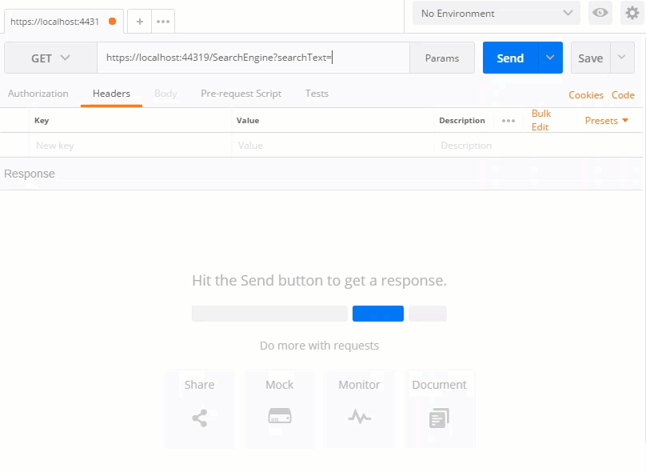
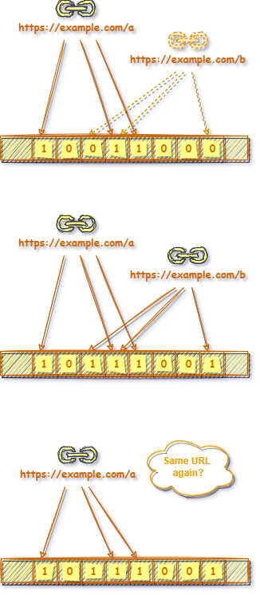

# MySearchEngine

English | [中文](README-CN.md)

MySearchEngine is a learning and practice project for searching. It is developed by C# language in .Net 5.0 environment.

## Target
Try NOT use any 3rd party tools, and build a simple search engine by myself.  
The source data comes from internet. We will start with web crawling, text analyzing, index building. At last, it should support searching, the result should be sorted by relevance score.

## How to start
1. Run [QueueService](start_queue.bat).
1. Run [WebCrawler](start_crawler.bat). Input any URL to start crawling. Note: links only in the same domain will be crawled.
1. Run [Server](start_sever.bat). The background thread will start text analyzing automatically. You can start search via Swagger page simultaneously.  



Note: If you want to skip crawling stage, you can copy files in [res_bak](res_bak) into [res](res). I've pre-crawled more than 10,000+ pages.

## Project Structure
MySearchEngine consits of three runable consoles and one core library.


Note：Client can be anything calling Server API

- MySearchEngine.Core

  It contains a few core algorithm about searching.

- MySearchEngine.QueueService

  It is a simple queue service. It's responsible to transit the HTML content crawled from internet to Server.

- MySearchEngine.WebCrawler

  It is a web crawler.

- MySearchEngine.Server

  Server indexes the HTML content, and serve API endpoint for searching.

## Processing Stage
1. Web Crawling Stage

   I like the website [DifferenceBetween](https://www.differencebetween.com). So I want to crawl this site for searching. However, because most of the contents on DifferenceBetween are very technical, I'd choose start crawling from [Language Category](https://www.differencebetween.com/category/language/)……  
   Crawler's responsibility is downloading pages, and grab all links from the page. Then choose those valuable links to crawl again. Repeat these steps. The key point for this stage is ***How to determine whether a link has been visited or not?***   
   It's quite obivious that when time goes by, the visited links grows rapidly. We'll run into issues if use Arrary，Dictionary or HashMap to store links. They will have either performance issue or memory issue. So ***Bloom Filter*** is recommended for this case.  

   > ***Bloom Filter***
   >
   > [Bloom Filter](https://en.wikipedia.org/wiki/Bloom_filter) is a space-efficient probabilistic data structure. It maintains a bit array of m bits, all set to 0. Its principle is to obtain the hash values of the source text throught several different hash functions. After taking the modulo of each hash value, we set the bit array at the corresponding position to 1.  
   > In this way, when a new source text comes, a query returns either "possibly in set" (by all 1s) or "definitely not in set" (by at least one zero).   
   > The problem for Bloom Filter is hash collision. It makes "possibly in set", which means some source text will be missing visited. But it is acceptable in web crawling. 
   >
   > 
   >
   > Implemented at [BloomFilter](src/MySearchEngine.Core/Algorithm/BloomFilter.cs)

1. Index Creating Stage
  
   In the stage of index creation, its essence is the process of analyzing the text. The outcome of text analysis is a set of tokens, which are words or phrases in the text.  
   Reference to the design of Elasticsearch's analyzer, the analysis can be divided into three processes: Character filter(s), Tokenizer, Token filter(s)。Among them, Filter(s) can be multiple, which are executed in order.  
   - Character filter(s)：Used to add, delete or change the characters contained in the original text.
   - Tokenizer：Used to decompose the content after Character filter(s) into Tokens. Because I've crawled all web pages in English, so I'll use whitespace to separate each word.
   - Token filter(s)：Used to further process decomposed Tokens. For example, convert to lowercase, merge the same stems, add synonyms, and so on.   
   
   
   > The process of ***Analyzing***  
   >
   >   
   > 
   > Take an example of below input:  
   > ```html
   > <div><p>The QUICK brown fox jumps.</p></div>
   > ```
   > 
   > |Process|Description|Outcome|
   > |---|---|---|
   > |[HtmlElementFilter](src/MySearchEngine.Core/Analyzer/CharacterFilters/HtmlElementFilter.cs)|Remove Html elements. |The QUICK brown fox jumps. |
   > |[SimpleTokenizer](src/MySearchEngine.Core/Analyzer/Tokenizers/SimpleTokenizer.cs)|Split text to tokens by whitespace. Leave only letters & digits.|["The", "QUICK", "brown", "fox", "jumps"]|
   > |[LowercaseTokenFilter](src/MySearchEngine.Core/Analyzer/TokenFilters/LowercaseTokenFilter.cs)|Update tokens to lowercased.|["the", "quick", "brown", "fox", "jumps"]|
   > |[StemmerTokenFilter](src/MySearchEngine.Core/Analyzer/TokenFilters/StemmerTokenFilter.cs)|Update tokens to its stem using [PorterStemmer](https://iq.opengenus.org/porter-stemmer/).|["the", "quick", "brown", "fox", "jump"]|
   > |[StopWordTokenFilter](src/MySearchEngine.Core/Analyzer/TokenFilters/StopWordTokenFilter.cs)|Remove tokens of stop words.|["quick", "brown", "fox", "jump"]|
   >
   > Ref. to [Analyzer Anatomy](https://www.elastic.co/guide/en/elasticsearch/reference/current/analyzer-anatomy.html)
   
   Above is the basic process of analyzing. In real circumstance, it will be much more complicated. More issues (such as support for phrase or other languages, auto-complete function, etc...) must be concerned.  
   
   > ***Support for phrase or other languages***  
   >
   > In case of phrase ``Renmin University of China``, or Chinese like ``中国人民大学``, these phrases cannot be splitted by whitespace. How to support them?  
   > At first we need to prepare a phrase list. Please note, except those common phrases, according to different domain, the list will also be different.
   >
   > Note: Not Implemented
   
   
   > ***Auto-Complete***
   >
   > Auto-Complete refers to the function of automatically completing the content according to your input. It's just like the search textbox in Google.
   >
   > To achieve this, we only need to do some special processing in Tokenizer. Simply put, a Token need to be split into several Tokens according to each character. For example:  
   > ```csharp
   > ["apple"] => ["a", "ap", "app", "appl", "apple"]
   > ```
   > Obviously, this processing will take up more space. Generally, it is not very helpful for searching the entire webpage, so it is not implemented in the program.
   > 
   > Note: Not Implemented
   
   
   Now, we have a set of terms and a set of docs/pages on hand. Next, we are going to build the most important ***Inverted Index***.
   
   > ***Inverted Index***
   >
   
1. Index Storing Stage

   - Store each Term as format `{term}|{termId}` into `term.bin` file.
   - Store each Document as format `{docId}|{title}|{url}|{allTermsInDoc}` into `doc.bin` file. (Note: {title} is only for reference. It will not be indexed.) 
   - Store each inverted index as format `{termId}|{docId}:{termCountInDoc},...` into `index.bin` file. (Note: Split each document by comma.)

1. Searching Stage

   Same as the indexing, the input SearchText is analyzed with TextAnalyzer to get a set of Tokens. Then find the corresponding Document through the inverted index. Finally, use TF-IDF to calculate the score.
   
   > ***Damerau-Levenshtein Distance***
   >
   > [Damerau-Levenshtein Distance](https://en.wikipedia.org/wiki/Damerau%E2%80%93Levenshtein_distance) is a string metric for measuring the edit distance between two sequences.
   > It is very helpful to handle misspelling. Which means if I search for "apole", it can return the result of "apple" as well. The edit distance between "apole" and "apple" is 1.
   >
   > Implemented at [DamerauLevenshteinDistance](src/MySearchEngine.Core/Algorithm/DamerauLevenshteinDistance.cs)
   
   > ***TF-IDF***（Term Frequency - Inverse Document Frequency） 
   >
   > [Term Frequency - Inverse Document Frequency](http://tfidf.com/) is an algorithm to evaluate how important a word is to a document in a collection or corpus.
   > It consits of two parts.
   > 
   > Term Frequency: It is generally believed that the more the same term appears in a document, the higher the importance of this term in this document.  
   > ```
   > TF(t) = (Number of times term t appears in a document) / (Total number of terms in the document)
   > ```
   >
   > Inverse Document Frequency：On the contrary, the more the same term appears in different documents, the more general the term will be. Its relative importance is lower.
   > ```
   > IDF(t) = log(Total number of documents / Number of documents with term t in it)
   > // Use base 10 log here
   > ```
   >
   > Implemented at [TfIdf](src/MySearchEngine.Core/Algorithm/Tf_Idf.cs)
   
## Summary
Searching is a very interesting process. It contains various ideas, algorithms and logics. Surprisingly, the storage capacity of the index results is very small (under the premise of uncompressed, indexing 10,000+ web pages only takes up 15MB of capacity), and there is no need to keep the original documents.

## Features
- [x] Web Crawler
- [ ] Index Building
	- [x] Character Filter
		- [x] Html Filter
	- [ ] Tokenizer
		- [x] Simple Tokenizer
		- [ ] Support phrase
	- [ ] Token Filter
		- [x] Lowercase Filter
		- [x] Stemmer Filter
		- [x] Stop Words Filter
		- [ ] Synonym Filter
- [x] Index Storage
	- [x] Term
	- [x] Doc
	- [x] Inverted Index
- [ ] Search
    - [ ] Damerau-Levenshtein Distance
	- [x] TF-IDF
	- [ ] BM25